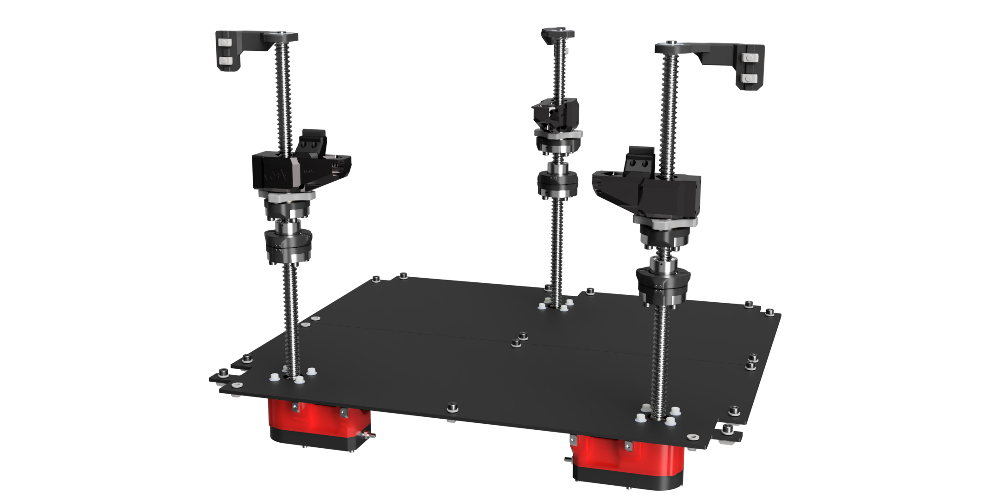

## -/ Z SYSTEM 3.0 (For Vcore 4)

# -/ Z-Upgrade 1204/1605 4.0

A Z-Upgrade complete overhaul for VCORE 4.0/4.1
The Z-Upgrade replace the original Z system with a ballscrews driven system.
More precise, more reliable over time, it offers a very high repeatability and a perfect consistancy in layer staking compared to a trapezoidal screw.
Maintenance-free and made to last in a production line. No wobble over Z.
Proofed design since 2021. More than 450+ happy users

Lifetime support and warranty over the parts

Integrated design pushed further to maximize fonctions and size to keep the whole print Z volume
Following the feedbacks, tests, assemblies, this version is born to simplify, and solve all the little things from the 3.x versions.
Parts count reduced, hardware quantity reduced, steps of assembly reduced, price reduced!

Version|Description|ReleaseDate|CAD|Printable|BOM|Documentation|License|Order
-------------|-----------|-----------|-----------|------------|------------|----------|-----------|-----------
**V4.0a 1605 ACTIVE| SFU1605 Version - Release |01/02/26| > | [Files](https://www.printables.com/model/1577140-z-upgrade-40-for-vcore-4041)| [BOM]In Progress | [MANUAL]In Progress || [SHOP on the Store](https://store.brs-engineering.com/products/z-upgrade-4-0-for-vcore-4-0-4-1)

# -/ Z-Upgrade 1204/1605 3.0

Adaptation of the production grade "Z-Upgrade" for VCORE 4.0
Upgrade to replace the original Z with a ballscrew system.
More precise, very reliable over time, offers a very high repeatability in the Z movement compared to a trapezoidal screw.
Maintenance-free*. Made to last in a production line. No wobble over Z. Proofed design over 2021. More than 350+ users since 2021.
A Reinforced version of the 1605 is available too for heavy duty projects. This system has virtually no Z limitations in size, you can dream of the best you can pick ;)

A lot of things has been reworked on this iteration compare to the previous Z-Upgrade 2.0:

-Simplification of parts list, easier implementation. direct bolt in upgrade.

-Directly bolted to the VCORE 4.0 frame and underplate. Re-use the Stock VC4 top retainers (1204 version) + bearings.

-No need of surelevation; the Stock VC4 feet will only need to be adjusted to the height. (+17mm)

-Compatible natively with Wobble X, Oldham V3 proofed printed rings compatible too

-Dense integration of the Oldham/Wobble X in the Arms

-Motor reduction for a very high holding torque, even when the motor aren't active. Proofed for heavy custom bed, or bigger custom print volume machines. Vcore 500 can now run standard Nema 17 without risks of fall when the motor are powered off

-Motor reduction + ballscrew allowing an insane precision over the Z-Motion, extreme constistency, allow thin and repetable layer over time

-No maintenance needed (cleaning+thin lubrication once a year is enough)

-Z-motors easy tension over the 6mm timing belt with 1x M5 screw

-Add +10mm of Z distance (Oldham V3), or +15mm with Wobble X

-All included, no self soucing to do.

[GUIDE TO CHOOSE and PATCH NOTE](https://github.com/FlorentBroise/BRS-Printers-Mod/blob/main/manuals/Z-Upgrade-3.2C-Variants.pdf)

Version|Description|ReleaseDate|CAD|Printable|BOM|Documentation|License|Order
-------------|-----------|-----------|-----------|------------|------------|----------|-----------|-----------
**V3.0a 1204 DEPRECATED| SFU1204 Version - This version is made to simplify the integration to a stock VCORE 4 (All versions), By taking the same footprint that the stock VCORE 4 parts. You can then use the stock bottom panel you already have, and (PRECISE BOM listed bellow). NO NEED for clearance bellow the frame, tuning the stock Z feet height is enough!. This version keep the same Z volume (+10-15mm bonus) than the stock machine|30/04/24| > |  | [BOM](https://docs.google.com/spreadsheets/d/1E3s1GYlrxwITHgYWx6jKaRsaI9jWW35iHJ5XEkeNflE/edit?gid=0#gid=0) | [MANUAL](/manuals/Z-Upgrade-3.0-Manual-1.0.pdf) ||/
**V3.1a/b 1204 DEPRECATED| SFU1204 + SFU1605 added. - This version is made to implement 1605 version (b) and to change all bottop plate screws to m3x20mm to simplify sourcing|12/11/24| > |  | [BOM](https://docs.google.com/spreadsheets/d/1E3s1GYlrxwITHgYWx6jKaRsaI9jWW35iHJ5XEkeNflE/edit?gid=0#gid=0) | [MANUAL](/manuals/Z-Upgrade-3.0-Manual-1.0.pdf) ||/
**V3.2c 1204/1605 DEPRECATED| SFU1605/SFU1204 Version - This version is made to simplify the production and manufacturing on the BRS side, it merges the 1605 and 1204 designs to count less parts, StarLock design created, some adjustments made on the general design [Z-Upgrade 3.2 PATCHNOTE.pdf](https://github.com/user-attachments/files/17843025/Z-Upgrade.3.2.PATCHNOTE.pdf)|21/01/25| > | [1605 STL-STEP-F3z](https://www.printables.com/model/1033344-z-upgrade-32-for-vcore-40-sfu1605-sfu1204) [1204 STL-STEP-F3z](https://www.printables.com/model/1419210-z-upgrade-32d-sfu1204-arm-kit) | [BOM](https://docs.google.com/spreadsheets/d/1E3s1GYlrxwITHgYWx6jKaRsaI9jWW35iHJ5XEkeNflE/edit?gid=0#gid=0) | [MANUAL](/manuals/Z-Upgrade-3.0-Manual-1.0.pdf) ||[SHOP ](https://store.brs-engineering.com/products/z-upgrade-3-0-sfu1605-vcore-4-0)
**V3.2c-H 1605 ADEPRECATED| SFU1605 Version - This is the Z-Upgrade 3.2C-H iteration (H, for heavy), It answers the need to make a very tall printer (800-1500mm)|17/03/25| > | [STL-STEP-F3z](https://www.printables.com/model/1233695-z-upgrade-32c-h-for-tall-vcore-40-sfu1605) | BOM In progress | [MANUAL](/manuals/Z-Upgrade-3.0-Manual-1.0.pdf) ||[SHOP ](https://store.brs-engineering.com/products/z-upgrade-3-2c-sfu1605-reinforcedvcore-4-0)
**V3.2d 1204/1605 DEPRECATED| SFU1605/SFU1204 Version - Upgrade or the arm design with retaining spings to secure the wobble assembly na dprevent accident or ball bearing drops [Z-Upgrade 3.2d PATCHNOTE.pdf]() Soon |16/06/25| > | [STL-STEP-F3z](https://www.printables.com/model/1033344-z-upgrade-32-for-vcore-40-sfu1605-sfu1204) | [BOM](https://docs.google.com/spreadsheets/d/1E3s1GYlrxwITHgYWx6jKaRsaI9jWW35iHJ5XEkeNflE/edit?gid=0#gid=0) | [MANUAL](/manuals/Z-Upgrade-3.0-Manual-1.0.pdf) ||[SHOP ](https://store.brs-engineering.com/products/z-upgrade-3-0-sfu1605-vcore-4-0)
**V3.2d-H 1605 DEPRECATED| SFU1605 Version - This is the Z-Upgrade 3.2d-H iteration (H, for heavy), It answers the need to make a very tall printer (800-1500mm) Upgrade or the arm design with retaining spings to secure the wobble assembly and prevent accidents or ball bearing drops|16/06/25| > | [STL-STEP-F3z](https://www.printables.com/model/1233695-z-upgrade-32c-h-for-tall-vcore-40-sfu1605) | BOM In progress | [MANUAL](/manuals/Z-Upgrade-3.0-Manual-1.0.pdf) ||[SHOP ](https://store.brs-engineering.com/products/z-upgrade-3-2c-sfu1605-reinforcedvcore-4-0)

## -/ Creative Commons known infringment to the model

Version|Description|Release Date of the illegal copy|CC infringment|Origin|Documentation|License|Action taken
-------------|-----------|-----------|-----------|------------|------------|----------|-----------
**V3.x| SFU1605 Version Copy-paste product |+-June 2025| YES - BY no credits and NC comercial usage | PRINT BIG (Core AM GmBh) | [Demonstration](/image/PB-CC-ZU3x.pdf) |  | PRINT BIG refuse to comply to the CC yet, no further action taken yet

## -/ Z SYSTEM 2.0 (For Vcore 3.0/3.1)

# -/ Z SYSTEM 1204 2.8DE (For Vcore 3.0/3.1)

- Z-Ballscrews-upgrade 2.8 LAST AND DEFINITIVE REVISION
High precision Z system with anti-wobble system

Avantages:
-Easy installation over a Stock 3.1
-Increase Z repetability
-Lower maintenance, no wear like the TR8 LS/nut
-High precision accuracy over time, made to last in a production line.
-No wobble over Z
-Proofed design over 2021. More than 350+ users since 2021. Lifetime Support
-Easy implementation to any Vcore, use the same bottom pannel patern than stock

Version|Description|ReleaseDate|CAD|Printable|BOM|Documentation|License|Order
-------------|-----------|-----------|-----------|------------|------------|----------|-----------|-----------
**V2.8a 1204| SFU1204 Version - Last revision of the Z-Upgrade 2.0, This version is made to simplify the integration to a stock VCORE 3.1 (All versions), By taking the same footprint that the stock VCORE 3.1 parts. You can then use the stock bottom panel you already have, and recycle the stock screws list to limit an extended new selfsourcing process; you will need to source some additionnal screws (PRECISE BOM listed bellow). Need a clearance bellows the frame, the use of 70mm feets will be mandatory. This version keep the same Z volume than the stock machine, no more Z reduction!|11/02/24| [STEP](https://github.com/FlorentBroise/BRS-Printers-Mod/blob/main/cad/Z-upgrade-28-DE.zip) | [STL](https://www.printables.com/model/763486-z-upgrade-28-definitive-edition) | [BOM](https://docs.google.com/spreadsheets/d/1hA8UdFV7IhUFEDgt_LVLpt3l6aZIOX_8x9tYVwdvjZA/edit?usp=sharing) | [MANUAL](https://github.com/FlorentBroise/BRS-Printers-Mod/blob/main/manuals/manual2EN.pdf) ||[SHOP](https://store.brs-engineering.com/products/z-upgrade-2-0-vcore-3-x)
# -/ Z SYSTEM 1605 2.8DE (For Vcore 3.0/3.1)
The last Z-Upgrade 1605 version stopped at 2.8DE revision.

Avantages:
-Easy installation over a Stock 3.1
-Increase Z repetability
-Lower maintenance, no wear like the TR8 LS/nut
-High precision accuracy over time, made to last in a production line.
-No wobble over Z
-Proofed design over 2021. More than 350+ users since 2021. Lifetime Support
-For CUSTOM long size machines, can be scale to insane lenghts

Version|Description|ReleaseDate|CAD|Printable|BOM|Documentation|License|Order
-------------|-----------|-----------|-----------|------------|------------|----------|-----------|-----------
**V2.8b Heavy Duty 1605 EXTENDED| SFU0605 Version - Last revision of the Z-Upgrade 2.8 1605, |22/08/24| [STEP](https://www.printables.com/model/982028-z-upgrade-28c-definitive-edition-1605-brs-oldham) | | | [MANUAL](https://github.com/FlorentBroise/BRS-Printers-Mod/blob/main/manuals/manual2EN.pdf) ||[SHOP](https://store.brs-engineering.com/products/z-upgrade-2-0-vcore-3-x)

# -/ Z SYSTEM 1605 2.7 (For Vcore 3.0/3.1)(Deprecated for 2.8b DE)
The last Z-Upgrade 1605 version stopped at 2.1 revision.

Avantages:
-Easy installation over a Stock 3.1
-Increase Z repetability
-Lower maintenance, no wear like the TR8 LS/nut
-High precision accuracy over time, made to last in a production line.
-No wobble over Z
-Proofed design over 2021. More than 350+ users since 2021. Lifetime Support
-For CUSTOM long size machines, can be scale to insane lenghts

Version|Description|ReleaseDate|CAD|Printable|BOM|Documentation|License|Order
-------------|-----------|-----------|-----------|------------|------------|----------|-----------|-----------
**V2.1b Heavy Duty 1605 EXTENDED| SFU0605 Version - Last revision of the Z-Upgrade 2.0 1605, some correction of the offsets have been made|13/03/24| [STEP](https://github.com/FlorentBroise/BRS-Printers-Mod/raw/main/cad/ZU20b-1605.zip) | | | [MANUAL](https://github.com/FlorentBroise/BRS-Printers-Mod/blob/main/manuals/manual2EN.pdf) ||[SHOP](https://store.brs-engineering.com/products/z-upgrade-2-0-vcore-3-x)

Credits: 

-@Ratrig for the VCORE-3.0/3.1/4.0 amazing design

-@MirageC / EVOMOTO Oldham/Wobblex magical design
