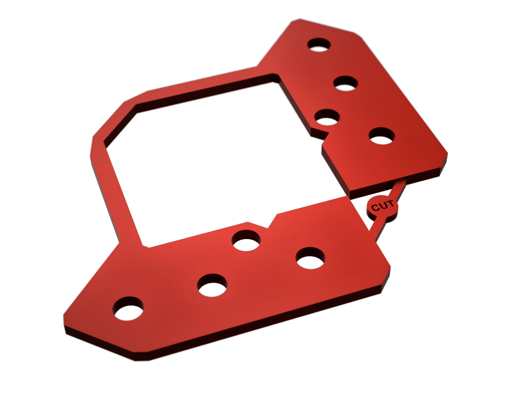

# LEGACY DEPRECATED PARTS
## -/ Z SYSTEM 1.0

- Z-Ballscrews-upgrade 1
High precision Z system with anti-wobble system 

Version|Description|ReleaseDate|CAD|Thingiverse|Documentation|License|Order
-------------|-----------|-----------|-----------|------------|------------|-----------|-----------
**V1.6**|  Last version available. Holes added to access the NEMA17 screws for tuning alignment |29/09/21|[STEP](https://drive.google.com/file/d/1DvUyMbXhosZOEtiP2zKSWmIGoYd-C9qh/view?usp=sharing)| [STL](https://www.thingiverse.com/thing:4978199) || except wings design
**V1.96a**|  Documentation links implementation |11/03/22|||[Manuals](https://github.com/FlorentBroise/BRS-Printers-Mod/tree/main/manuals)| except wings design|[SHOP](https://www.brs-engineering.com/Vcore.html)
**V1.96b**|  Wings coupling DEPRECATED, Oldham to be installed|18/04/22|||||[SHOP](https://www.brs-engineering.com/Vcore.html)
**V1.97a**|  Last version available. Geometry Updated for lighter parts / compatible VC3.0/3.1 (same assembly method) |19/04/22|[ZIP](https://github.com/FlorentBroise/BRS-Printers-Mod/tree/main/cad/1-97a.zip)| |||[SHOP](https://www.brs-engineering.com/Vcore.html)

## -/ Z SYSTEM 2.0

- Z-Ballscrews-upgrade 2
High precision Z system with anti-wobble system 

Version|Description|ReleaseDate|CAD|STL|Documentation|License|Order
-------------|-----------|-----------|-----------|------------|------------|-----------|-----------
**V2.0a Heavy Duty 1204 EXTENDED**| SFU1204 Version - Extend the Z distance of 50mm (need  50mm longer ballscrews spindles), available for 0-2-3-4mm underplates otherwise through height modualator. Corner completly reinforced and high ability, keep the frame aligned from the spindle Axis, use the same Arms, Oldham and Retainer than previous Z upgrade version. Compatible  NEMA17 and NEMA23. Need a clearance bellows the frame, Compatible with every VCore 3.x machines,.|16/01/23| Outdated | Outdated 22| / ||[SHOP](https://store.brs-engineering.com/products/z-upgrade-2-0-vcore-3-x)
**V2.05a Heavy Duty 1204 EXTENDED**|First revision, correcting few CAD errors, some optimisations. [PATCH-NOTE](https://github.com/FlorentBroise/BRS-Printers-Mod/tree/main/patch/BRSZU205aPN.pdf)|20/02/23| /| / | [MANUAL](/manuals/manual2EN.pdf)/ [Troubleshoot](/manuals/TroubleshootingZ.pdf) ||[SHOP](https://store.brs-engineering.com/products/z-upgrade-2-0-vcore-3-x)
**V2.06a Heavy Duty 1204 EXTENDED**|Second revision, correcting few CAD errors, some optimisations. [PATCH-NOTE](https://github.com/FlorentBroise/BRS-Printers-Mod/tree/main/patch/BRSZU206aPN.pdf)|06/03/23| [STEP](https://github.com/FlorentBroise/BRS-Printers-Mod/raw/main/cad/Z-upgrade-2-06a.zip)| / | [MANUAL](/manuals/manual2EN.pdf)/ [Troubleshoot](/manuals/TroubleshootingZ.pdf) ||[SHOP](https://store.brs-engineering.com/products/z-upgrade-2-0-vcore-3-x)
**1204 POS2 ARMS**| SFU1204 Version - Allow to be mounted with the 3.1 rails positions (rear of the front Z 3030). Opening the ZU1.x and 2.0a to the Official Ratrig 2.0 Enclosure kit.|20/02/23| [STEP](https://github.com/FlorentBroise/BRS-Printers-Mod/raw/main/cad/ARM31.step) | / | / ||
**V2.0b Heavy Duty 1605 EXTENDED**| SFU1605 Version (! need of MGN12H carriage !)|04/02/23| [STEP](https://github.com/FlorentBroise/BRS-Printers-Mod/raw/main/cad/Z-Upgrade-2.0b.zip) | / | / ||[SOON]
**V2.05b Heavy Duty 1204 EXTENDED**|First revision, correcting few CAD errors, some optimisations.|22/02/23| [STEP] | / | / ||[SHOP](https://store.brs-engineering.com/products/z-upgrade-2-0-vcore-3-x)
**V2.05b ZU2.x 3mm Spacer**|  A spacer to be used if no enclosure bottom plate is placed.|08/05/23| [3MF](https://github.com/FlorentBroise/BRS-Printers-Mod/raw/main/cad/3mmSPACER.3mf) | / | / ||[SHOP](https://store.brs-engineering.com/products/z-upgrade-2-0-vcore-3-x)
**V2.05b ZU2.x 75mm Feet v1.1**| 1st revision with the T slider a bit reduced to 10mm to let the space for some M6 screws|15/06/23| [STEP](https://github.com/FlorentBroise/BRS-Printers-Mod/raw/main/cad/ZUfeet2.step) | | / ||[SHOP](https://store.brs-engineering.com/products/pieds-x4-pour-vcore-3)
**V2.06a Heavy Duty 1204 3.1 Top**|Add a safety bumper for the MGN carriage|05/07/23| [STEP](https://github.com/FlorentBroise/BRS-Printers-Mod/raw/main/cad/BRS-Open-Front-31.zip) | | / ||[SHOP](https://store.brs-engineering.com/products/z-upgrade-2-0-vcore-3-x)
**V2.7a Heavy Duty 1204 3.1 Simple**|  SFU1204 Version - direct adaptation on a stock VC3.1 with the footprints of the bottom plates conserved! You can directly assemble it by swaping the stock Leadcrew pillars with the Ballscrew version. This 2.7th version is basically the same, buth the base block Geometry! ONLY FOR 1204 Ballscrews|29/10/23|[STEP](https://drive.google.com/file/d/1i3fC8A2Sot7tyuvSnKsozXAluxPpP1m1/view?usp=sharing) | | / ||[SHOP](https://store.brs-engineering.com/products/z-upgrade-2-0-vcore-3-x)
**V2.055a Heavy Duty 1204/1605 3.1 Top**|Replace the top front section with the ballscrew top retainer for the new VCORE 3.1 idler plates. Available for stock M5 screw and Precision shoulder bolt. Replace the old stock ZU2.0 BRS open front design since the 04/07/23|04/07/23| / | | / ||[SHOP](https://store.brs-engineering.com/products/z-upgrade-2-0-vcore-3-x)
**V2.056a Heavy Duty 1204/1605 3.1 Top**|FIX an distance issue in the part|22/09/23| [STEP](https://github.com/FlorentBroise/BRS-Printers-Mod/raw/main/cad/BRS-Open-Front-v3.zip) | | / ||[SHOP](https://store.brs-engineering.com/products/z-upgrade-2-0-vcore-3-x)
## 1 UltraLight Gantry XY v1 (DEPRECATED)

Version|Description|ReleaseDate|CAD|Files|License
-------------|-----------|-----------|-----------|------------|------------
**va2.6**(DEPRECATED)| DEPRECATED because of the belt tension forcing the crossbar to bend a bit after few months)   |Jan 2022|||
**v2.7**(DEPRECATED)| Adding of Shoulder bolt solution on the whole Gantry   |Dec 2021|

## 2 BRSVS High volume cooling solution (DEPRECATED)
High CFM Laminar cooling solution to remove fans from the head, giving more cooling power (PLA) and less weight for the toolhead

Version|Description|ReleaseDate|CAD|Thingiverse|License
-------------|-----------|-----------|-----------|------------|------------
1.2b|   |30 Nov 2021| [CAD and Instructions](https://github.com/FlorentBroise/RatRig-Upgrades/blob/main/BRSVS.md) || 

## 3 Flathead v1 Ecosystem (DEPRECATED and replaced by the V2)
A toolhead where the hotend can be swapped at will, within 30sec, without loosing belt tension, and get versatility to adapt your needs in materials!

Version|Description|ReleaseDate|CAD|Thingiverse
-------------|-----------|-----------|-----------|------------
**V0.1-Hextrudort**(DEPRECATED)|| Based on the MirageC design from Hevort project|[CAD](/cad/toolheadv2.step)
**V1.1-LGX Mosquito**(DEPRECATED)|| LGX, Mosquito, Carbon fiber PA12 and titanium based head|  |/|
**V1.2-LGX-Lite Mosquito(DEPRECATED)|| LGX-lite, Mosquito/|  |/|
**V1.1-LGX V6 (DEPRECATED)|| LGX, E3D V6|  |/|
**V1.1-LGX Nova (DEPRECATED)|| LGX, Nova|  |/|
**V1.1-LGX Takoto (DEPRECATED)|| LGX, Takoto|  |/|
**V1.1-LGX Dragon (DEPRECATED)|| LGX, Dragon|  |/|
Carbon fiber and titanium based head, tagged as deprecated because of the compatibility with only the Light gantry va2.6. Technically Fonctionnal and adaptable, CAD will release soon |  |March 2022|

- FLATHEAD V2 parts (DEPRECATED)
A ultralight mosquito based toolhead, with Crystal geometric shroud face

Version|Description|Details|CAD|Release date|License|Order
-------------|-----------|-----------|-----------|------------|------------|-----------
**V1.21a-LGX-Lite Mosquito**|| Add the shroud for 8mm Inductive probe|  [Files](/cad/geo8.3mf) [BOM](/bom/BOM_Flatheadv2.xlsx)|22/03/22|

## 4 Toolboard (DEPRECATED)
Version|Description|ReleaseDate|Gerber|Thingiverse
-------------|-----------|-----------|-----------|------------
**V0.1-Toolboard**|| A PCB part to deliver a full modularity|  |Jan 2022|

## 5 Wings related parts (DEPRECATED)

- Ballscrew arms for Vcore 3 (Wings Version)

Version|Description|ReleaseDate|CAD|Thingiverse|License
-------------|-----------|-----------|-----------|------------|-----------
**V1.0**||12/01/22|| [Link](https://www.thingiverse.com/thing:5275766)| 

## 6 Shoulder-bolt mod precision parts (Replaced by the Active PMB mod)

- Reinforced Motor bracket mod with bearing

Version|Description|ReleaseDate|CAD|License
-------------|-----------|-----------|-----------|-----------
**STB-V1.1**|  Right top motor bracket added for the NEMA R, needs a 625ZZ bearing and a 1mm shim (WORKS ONLY with E3D motor, or any nema17 with a minimum of 27mm shaft lenght)|20/11/21|[Left 3MF](https://github.com/FlorentBroise/BRS-Printers-Mod/raw/main/cad/Bracket.3mf) [Right 3MF](https://github.com/FlorentBroise/BRS-Printers-Mod/raw/main/cad/BracketR.zip)|

- Shoulder-bolt mod precision parts

Version|Description|ReleaseDate|CAD|License
-------------|-----------|-----------|-----------|-----------
**SBS-V1.1**|  Compatible with the F695-2R - 695zz Pulley conversion|16/03/2022 | [TopL](https://github.com/FlorentBroise/BRS-Printers-Mod/raw/main/cad/top-left.zip) [TopR](https://github.com/FlorentBroise/BRS-Printers-Mod/raw/main/cad/top-right-bearing.zip) [IdlerR](https://github.com/FlorentBroise/BRS-Printers-Mod/raw/main/cad/Idler-L.3mf) [IdlerL](https://github.com/FlorentBroise/BRS-Printers-Mod/raw/main/cad/Idler-R.3mf)|

###ANTI-WOBBLE Flexure system for SFU Ballscrews
A more cost effective way to decouple XY for non straight ballscrews

Product|Status|View|Manual EN|Release date|Shop|CAD|License
-----------------|------|-----------------------------------| :----: |  :---------------: |  :---------------: |  :---------------: | :---------------:
FLEX-P V1.2 (proto designed 10/10/22)|DEPRECATED, does not correct Z specific angle precession deviation|  **FLEX-P-V1.2** A decoupling module based on a flexure mechanism for Z-axis on X and Y independantly. It keeps the advantages of the Oldham / Ring system, and decrease the overall cost, and reduce the manufacturing process to the minimum. It decreases the Z space too by beeing more compact than any anti wobble mechanism. Resistances validated to 25kg before degradation. Base thickness of 15mm for a PACF base, can be bigger to satisfy more rigidity on the decoupling motion, or more Z weight tolerances. Will be standard on the BRS-VULCAIN. Actually in proofing|/|03/23|/| |
